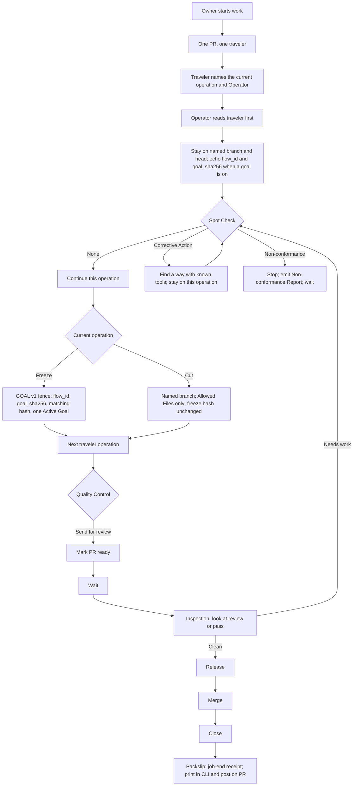

# Employee-manual Mermaid reconstruction probe 2

```mermaid
flowchart TD
    A[Owner starts work] --> B[One PR, one traveler]
    B --> C[Traveler names the current operation and Operator]
    C --> D[Operator reads traveler first]
    D --> E[Stay on named branch and head; echo flow_id and goal_sha256 when a goal is on]
    E --> F{Spot Check}
    F -->|None| G[Continue this operation]
    F -->|Corrective Action| H[Find a way with known tools; stay on this operation]
    H --> F
    F -->|Non-conformance| I[Stop; emit Non-conformance Report; wait]
    G --> J{Current operation}
    J -->|Freeze| K[GOAL v1 fence; flow_id, goal_sha256, matching hash, one Active Goal]
    J -->|Cut| L[Named branch; Allowed Files only; freeze hash unchanged]
    K --> M[Next traveler operation]
    L --> M
    M --> N{Quality Control}
    N -->|Send for review| O[Mark PR ready]
    O --> P[Wait]
    P --> Q[Inspection: look at review or pass]
    Q -->|Needs work| F
    Q -->|Clean| R[Release]
    R --> S[Merge]
    S --> T[Close]
    T --> U[Packslip: job-end receipt; print in CLI and post on PR]
```

Legend: The flowchart reconstructs the stated operating path. No collision was found among the named live-law sources.
