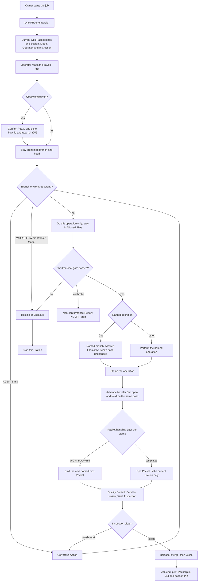

# Employee-manual Mermaid reconstruction probe 3

This is a descriptive reconstruction of the employee-manual operating flow
from `AGENTS.md`, `docs/GLOSSARY.md`, `docs/WORKFLOW.md`, and
`docs/templates/`. It does not change the governing documents.

Legend: Solid arrows show stated flow. The two arrows from “Branch or worktree
wrong?” are a collision: `AGENTS.md` requires Corrective Action, while
`docs/WORKFLOW.md` routes a Worker to a host fix or Escalate. The two packet
arrows are also a collision: `docs/WORKFLOW.md` says the finishing Operator
emits the next named packet after stamping, while `docs/templates/README.md`
defines the Ops Packet as the current Station only. Both are drawn without
selecting a new rule. “Non-conformance” stops and does not produce a Packslip.
