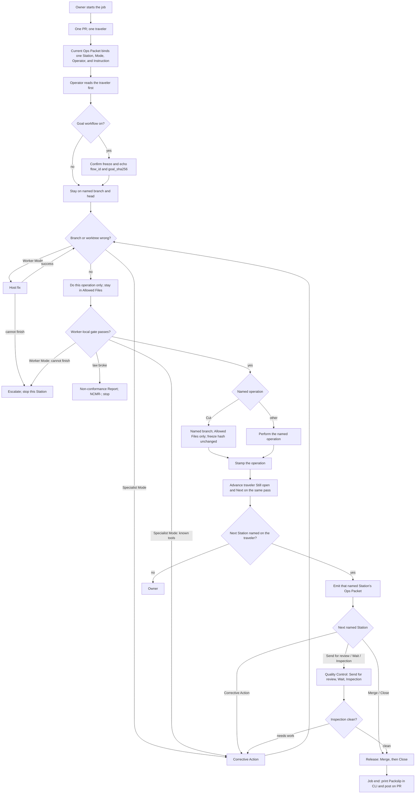

# Employee-manual Mermaid reconstruction probe 3

This is a descriptive reconstruction of the employee-manual operating flow
from `AGENTS.md`, `docs/GLOSSARY.md`, `docs/WORKFLOW.md`, and
`docs/templates/`. It does not change the governing documents.

Legend: Solid arrows show stated flow. For a wrong branch or worktree, a
successful Worker host fix returns to the branch/worktree check; only
“Escalate” stops the Station. After a stamp, the finishing Operator emits the
packet for the next Station named on the traveler; that packet is current for
that Station and describes that Station only. “Non-conformance” stops and does
not produce a Packslip.
