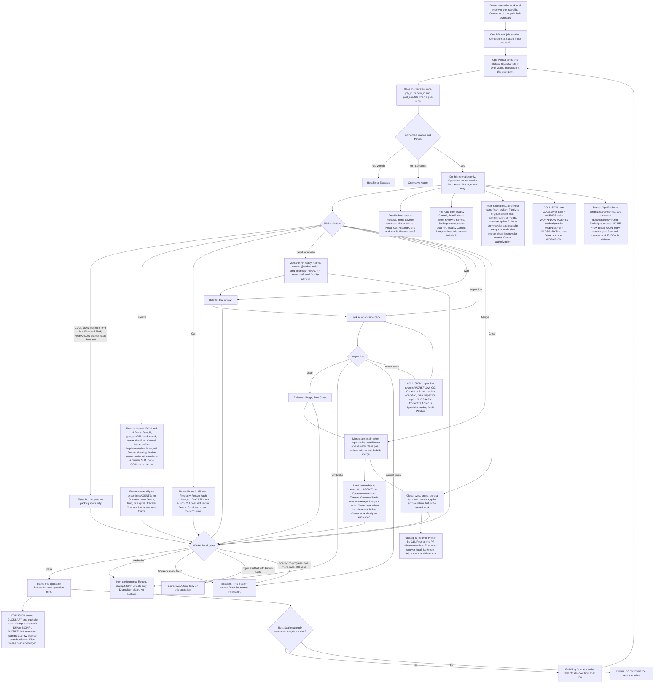

```mermaid
flowchart TD
  ownerStart["Owner starts the work and receives the packslip. Operators do not pick their own start."]
  job["One PR, one job traveler. Completing a Station is not job-end."]
  packet["Ops Packet binds this Station. Operator sits it. One Mode. Instruction is this operation."]
  ownerStart --> job --> packet

  packet --> readT["Read the traveler. Echo job_id, or flow_id and goal_sha256 when a goal is on."]
  readT --> onHead{"On named Branch and Head?"}
  onHead -->|"no / Worker"| wrongW["Host fix or Escalate"]
  onHead -->|"no / Specialist"| wrongS["Corrective Action"]
  onHead -->|"yes"| doOp["Do this operation only. Operators do not rewrite the traveler. Management may."]

  doOp --> station{"Which Station"}

  station -->|"COLLISION: packslip form lists Plan and Bind; WORKFLOW stamps table does not"| planBind["Plan / Bind appear on packslip rows only"]

  station -->|"Freeze"| freeze["Product freeze: GOAL.md v1 fence, flow_id, goal_sha256, hash match, one Active Goal. Commit freeze before implementation. Non-goal freeze: planning Station stamp on the job traveler is a commit SHA, not a GOAL.md v1 fence."]
  freeze --> freezeAuth["Freeze ownership vs execution: AGENTS: no Operator owns freeze, land, or a cycle. Traveler Operator line is who runs freeze."]

  station -->|"Cut"| cut["Named branch. Allowed Files only. Freeze hash unchanged. Draft PR is not a stop. Cut does not re-run freeze. Cut does not run the land suite."]

  station -->|"Send for review"| sfr["Mark the PR ready. Named review: @codex review and agents-pr-review. PR stays draft until Quality Control."]
  station -->|"Wait"| wait["Hold for that review."]
  station -->|"Inspection"| insp["Look at what came back."]
  sfr --> wait --> insp

  insp --> inspOut{"Inspection"}
  inspOut -->|"clean"| release["Release: Merge, then Close"]
  inspOut -->|"law broke"| ncmr["Non-conformance Report. Stamp NCMR-. Facts only. Disposition blank. No packslip."]
  inspOut -->|"cannot finish"| esc["Escalate. This Station cannot finish the named Instruction."]
  inspOut -->|"needs work"| inspCa["COLLISION Inspection rework: WORKFLOW QC: Corrective Action on this operation, then Inspection again. GLOSSARY: Corrective Action is Specialist ladder; Avoid Worker."]
  inspCa --> insp

  station -->|"Merge"| merge
  station -->|"Close"| closeSt
  release --> merge["Merge onto main when repo-backed confidence and named criteria pass, unless this traveler forbids merge."]
  merge --> landAuth["Land ownership vs execution: AGENTS: no Operator owns land. Traveler Operator line is who runs merge. Merge is not an Owner seat when that clearance holds. Owner at land only on escalation."]
  merge --> closeSt["Close: sync, prune, persist approved lessons, quiet archive when that is the named work."]
  closeSt --> packslip["Packslip is job-end. Print in the CLI. Post on the PR when one exists. First word is never /goal. No Model. Skip a row that did not run."]

  planBind --> gates
  freezeAuth --> gates
  cut --> gates
  sfr --> gates
  wait --> gates
  release --> gates
  landAuth --> gates
  closeSt --> gates

  gates{"Worker-local gates"}
  gates -->|"pass"| stampOp["Stamp this operation before the next operation runs."]
  gates -->|"law broke"| ncmr
  gates -->|"Worker cannot finish"| esc
  gates -->|"Specialist fail with known tools"| ca["Corrective Action. Stay on this operation."]
  gates -->|"one try, no progress, one more pass, still none"| esc

  stampOp --> stampMean["COLLISION stamp: GLOSSARY and packslip rules: Stamp is a commit SHA or NCMR-. WORKFLOW operation-stamps Cut row: named branch, Allowed Files, freeze hash unchanged."]
  stampOp --> nextNamed{"Next Station already named on the job traveler?"}
  nextNamed -->|"yes"| emitPkt["Finishing Operator emits that Ops Packet from that row."]
  nextNamed -->|"no"| toOwner["Owner. Do not invent the next operation."]
  emitPkt --> packet

  proof["Proof is host only at Release, in the traveler worktree. Not at freeze. Not at Cut. Missing Clerk auth env is blocked proof."]
  cycles["Full: Cut, then Quality Control, then Release when review is named. Lite: implement, stamp, draft PR, Quality Control. Merge unless this traveler forbids it."]
  mains["main exception 1: checkout sync fetch, switch, ff-only to origin/main; no edit, commit, push, or merge. main exception 2: docs-only traveler and packslip stamps on main after merge when this traveler names Owner authorization."]
  lawC["COLLISION Law: GLOSSARY Law = AGENTS.md + WORKFLOW. AGENTS Authority ranks AGENTS.md + GLOSSARY first, then GOAL.md, then WORKFLOW."]
  forms["Forms: Ops Packet = templates/traveler.md. Job traveler = docs/travelers/PR.md. Packslip = job-end. NCMR = law break. GOAL copy sheet = goal-form.md. create-handoff JSON is sidecar."]
  doOp --> proof
  doOp --> cycles
  doOp --> mains
  doOp --> lawC
  doOp --> forms
```

Legend: Reconstructed from AGENTS.md, docs/GLOSSARY.md, docs/WORKFLOW.md, and docs/templates/ only. No law improvement. COLLISION nodes draw both source claims and leave them unresolved.
