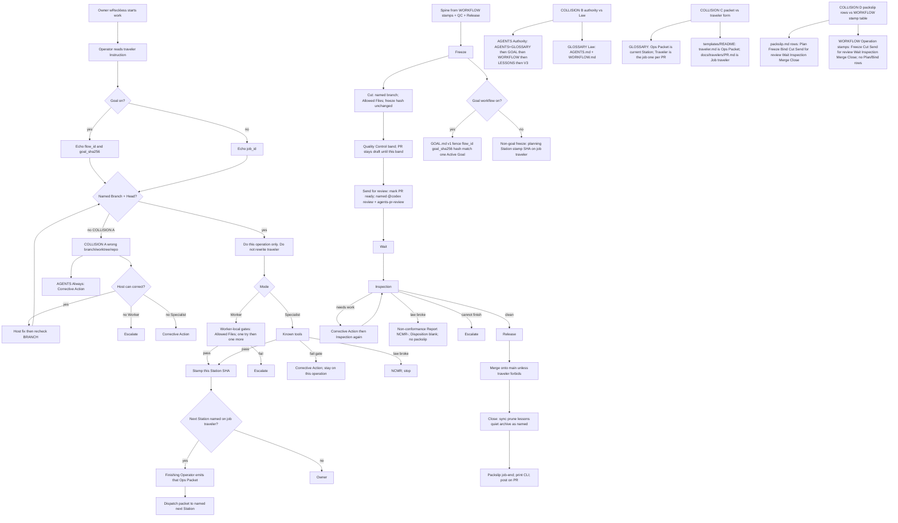

# Employee-manual flow reconstruct (probe-5)

Sources read only: `AGENTS.md`, `docs/GLOSSARY.md`, `docs/WORKFLOW.md`, `docs/templates/`. No law change.

Legend: reconstruct only. COLLISION A–D are disagreements left as drawn, not resolved. Completing a Station is not job-end; packslip is job-end. Worker stop is Escalate; Specialist ladder is Corrective Action then NCMR for law break. Proof/host suite is not at freeze or Cut.
