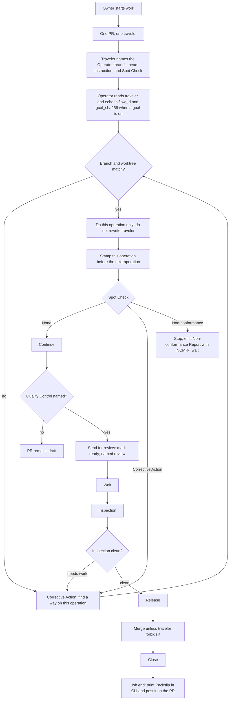

# Employee-manual flow — PR #80

Legend: solid arrows are the stated operating flow. “Corrective Action” loops
within the same operation; “Non-conformance” stops the operation and does not
produce a Packslip.
