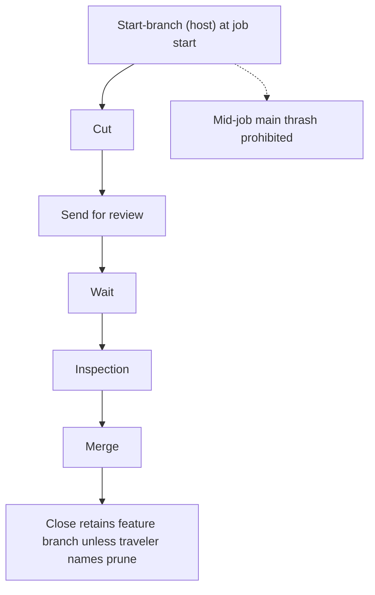

# Mermaid probe A — NestCalc cycle (Grok Build)

job_id: `NGJ-20260824-mp-a`
Operator under test: Grok Build
Cycle: Lite
Not product law. Docs-only probe.

## Purpose

One mermaid flowchart of the NestCalc lite cycle using **current** law:

- Start-branch (host) at job start
- Cut → Send for review → Wait → Inspection → Merge → Close
- Close retains feature branch unless traveler names prune
- Mid-job main thrash prohibited

## Diagram

<!-- Cut fills the mermaid block below. Do not invent Stations. -->

