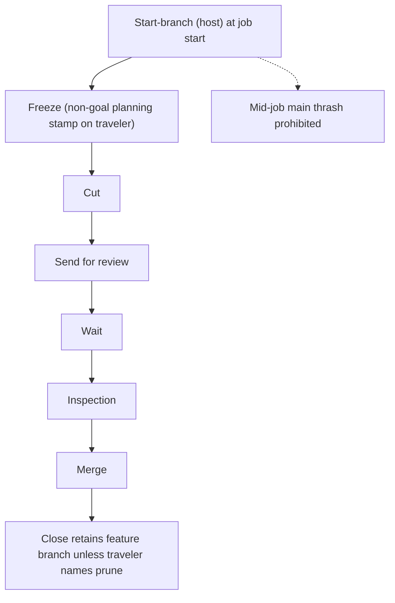

# Mermaid probe C — NestCalc cycle (Codex App)

job_id: `NGJ-20260824-mp-c`
Operator under test: Codex App
Cycle: **Full**
Not product law. Docs-only probe.

## Purpose

One mermaid flowchart of the NestCalc **full** cycle using **current** law:

- Start-branch (host) at job start
- Freeze (non-goal: planning Station stamp on job traveler — not GOAL.md v1 fence)
- Cut → Send for review → Wait → Inspection → Merge → Close
- Close retains feature branch unless traveler names prune
- Mid-job main thrash prohibited

Contrast probes A/B (Lite): full adds **Freeze** before Cut.

## Diagram

